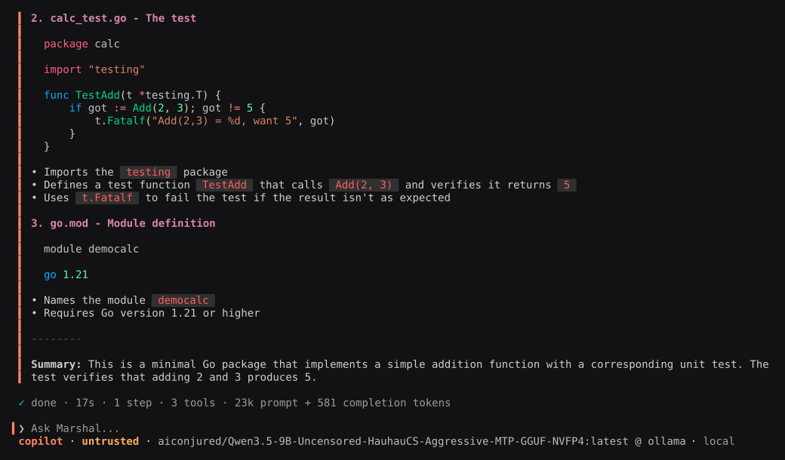
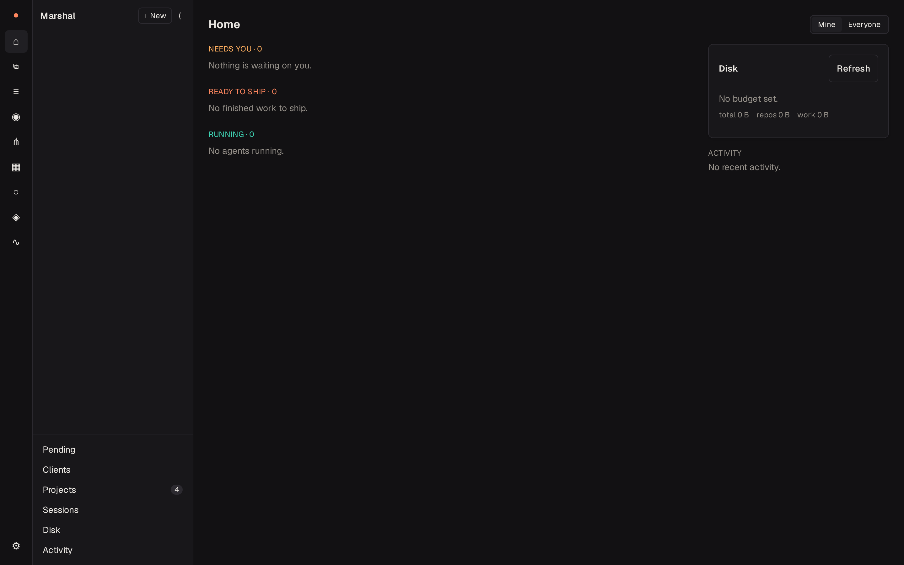

# Marshal

**A local-friendly coding agent that lives in your terminal — and, when you
want it, in your browser.**

Marshal reads your repository, edits files, runs commands and tests, and
remembers what it learned. It is built for models running on your own machine,
and treats hosted providers as something you opt into rather than something
you must sign up for.

> **Status: alpha (v0.0.3-alpha).** Usable day to day, but interfaces, config
> keys, and on-disk formats may change without a migration path before 0.1.0.



---

## Why Marshal

Most coding agents assume a hosted model, a flat permission model, and a single
session. Marshal was built the other way around, and four things fall out of
that:

- **Local models are first-class.** The default config ships no providers at
  all. Point Marshal at Ollama, LM Studio, llama.cpp or vLLM and you have a
  fully offline agent. Hosted providers are opt-in, not the baseline.
- **Every shell command is classified before it runs.** Marshal labels the
  risk, shows you why, and asks. Approved commands run under a sandbox by
  default. You choose how much friction you want, per session.
- **The agent has a memory that outlives the session.** When you exit, a
  knowledge pass distills the transcript into durable project memories and
  file summaries. Next session, they come back automatically.
- **It is a server as well as a CLI.** `webbridge` hosts many agents across
  many projects in one browser UI, with worktree isolation, an egress proxy,
  and automations that watch your repos.

## Quickstart

```bash
# Grab a prebuilt binary (Linux, macOS)
tar -xzf marshal_*_<os>_<arch>.tar.gz
sudo mv marshal /usr/local/bin/

# Or build from source (Go 1.26+ and a C toolchain)
CGO_ENABLED=1 go build ./cmd/marshal
```

Run `marshal` and the first launch walks you through connecting a provider.
Nothing is configured for you — Marshal has no built-in accounts and phones
home to nothing.

Marshal starts in **Default** mode, which is read-only: the agent can read and
search, but every write is denied until you approve it or switch to `/edit`,
`/copilot` or `/auto`. Local endpoints connect without ceremony; a non-local
base URL asks you to enable remote providers first.

```bash
marshal              # start the TUI
marshal --version    # build info
marshal acp          # headless ACP server over stdio
```

## Connect a model

The connect flow covers local and hosted providers alike:

| Local | Hosted |
|---|---|
| Ollama, LM Studio, llama.cpp, vLLM | OpenRouter, Anthropic, OpenAI, Google Gemini, DeepSeek, Groq, Mistral, Together, Fireworks, xAI, Cerebras, Kimi, OpenCode Zen, OpenAI (ChatGPT subscription) |

Any OpenAI-compatible endpoint works too — the "Custom" template takes a base
URL and nothing else.

Config merges in order, later wins: built-in defaults → `~/.config/marshal/config.toml`
→ `.marshal/config.toml` (per-project). Providers and model presets are
user-global only; a project config that carries them is hoisted into your user
config on load.

```toml
[providers.ollama]
type = "ollama"                          # native API; "openai_compatible" also works
base_url = "http://localhost:11434"

[models.presets.coder]
provider = "ollama"
model = "qwen2.5-coder:14b"
context_window = 32768
local_only = true          # required for a localhost endpoint; see note below

[profile]
default = "coder"
```

> **`local_only` is not optional for a local preset.** Remote providers are
> gated off by default, and that gate keys on this flag rather than on the
> base URL. Omit it and marshal reports `remote provider blocked` for your own
> machine. (Presets created through `/connect` set it for you.)

Different roles can use different models — a small local model for search and
summarisation, a frontier model for patches. See `/profiles` and `/agents`.

## What it does

### Repository intelligence

Marshal indexes your repository into SQLite: file hashes and languages, then
symbols, then optionally embeddings. Symbol extraction uses a language server
when one is found on your `PATH`, and falls back to tree-sitter grammars (Go,
TypeScript/JavaScript, Python, Rust) when it is not. From that index come the
repo map, per-file summaries, and the `repo.map`, `symbols.find` and
`codebase_search` tools; when a language server is available the agent also
gets `definition`, `references` and `hover`. Diagnostics are fed back into its
edits.

### Context that fits the window

The context pack builder assembles prompt context against a token budget.
Inspect usage at `/context`, and the exact request last sent to the model at
`/context request`. Long sessions can roll over instead of dying — `rollover`
summarises and archives older generations, and `/history` searches them. It is
on by default for local models with a small context window, and available to
enable explicitly for any other route.

### Knowledge and memory

On exit, a knowledge pass reviews the transcript, tool activity and touched
files, asks a model to distill them, and persists memories (tagged `fact`,
`architecture` or `decision`) plus file summaries to SQLite. Memory is read
back into the context pack on later turns. `/memory` opens a browser for
reviewing and pruning it.

### Safe, sandboxed tools

Shell commands are classified, labelled with a risk level, and approval-gated.
Three sandbox backends: `restricted` (the default — environment filtering,
working-directory confinement, and process-group kill on timeout), `container`
(per-command container execution, the only backend that isolates the network),
and `passthrough`. Resource caps on memory, CPU, file size and process count
are deliberately opt-in — a cap that kills legitimate builds just teaches
people to disable the sandbox.

Guardrails fail closed. `mkfs`, `shutdown`, `reboot` and recursive
force-deletes are denied outright. System access shrinks the list to that
catastrophic floor and re-admits a recursive delete only when every operand is
provably a relative literal. `git push` sits behind its own floor.

### Five modes, from read-only to autonomous

| Mode | Behaviour |
|---|---|
| **Plan** | Read-only; the agent must produce a numbered plan before touching anything |
| **Default** | Read-only; edits require explicit elevation |
| **Edit** | Writes, confirming each one |
| **Copilot** | Auto-approves; may still ask questions |
| **Auto** | Fully autonomous, no questions |

`/system` grants a separate modifier — full-filesystem read/write for the file
tools — without changing mode friction.

### Review and shipping

`/review` dispatches a reviewer subagent over the working tree, a `--base` ref,
or an explicit range. Work can be isolated per session in a git worktree
(`workspace.worktree`), then verified, committed and merged
(`workspace.finish`). Snapshots are git-backed, and `/undo` and `/redo` use
them to restore the working tree to a known point; `/rollback` reverts the
last patch from an in-session backup.

### Multi-agent work

`/swarm <goal>` runs a planner → parallel repo scouts → repeated implementer
and tester rounds → reviewer pipeline with budget caps. `/sdd` is the more
elaborate path: Marshal authors an executable plan from a goal, you review it,
and it then executes task-by-task with implementer and reviewer subagents, a
build-and-test gate, and controller-owned commits and fix rounds.

### Skills and plugins

Skills are loadable instruction sets — the agent can reach for one mid-session
when it matches the task. Eleven ship built in, covering brainstorming, plan
authoring, execution, debugging, TDD and verification. Plugins extend Marshal
with MCP servers and hooks; `/plugins` and `/mcp` manage them, and MCP servers
configured with `auth = "oauth"` get a browser login flow.

### The TUI

Marshal's terminal UI is a single-column stack designed for terminals covering
half a screen or less. The transcript is hierarchical — turn → task → step →
tool call — so narration and the tool calls it explains stay attached, and
finished tasks fold to one line. Three density levels (`Ctrl+G`, and per-node
with `Enter`) and a keyboard browse mode (`Esc`) give detail on demand, with a
full inspector (`i`) for any single step.

Ownership is visible: each step shows who did it — orchestrator, a named
subagent, or a pipeline role — and approvals show the requesting step's
narration as their reason.

### Web Studio

`webbridge` turns Marshal into a self-hosted studio: one place to run many
agents across many projects and repos.

```bash
webbridge --project /path/to/repo --addr 127.0.0.1:7700
```



It supervises one `marshal acp` child per agent and serves a Svelte SPA. Both
clients render the same turn → task → step → tool-call hierarchy, because the
agent serves that model over ACP and each client draws it its own way. The
browser side adds what a terminal cannot do well:

- **Fleet view** — an inbox of agents that need you, are ready to ship, or are
  running, plus a live wall.
- **Review and ship** — diffs by step, commit → verify → push → PR.
- **Workspaces** — reusable, versioned bundles of toolchains, mounts, secrets,
  network rules and a setup script, for containerized agents.
- **Egress proxy** — one shared proxy enforces per-agent network policy,
  injects credentials the agent never sees, and logs every connection.
- **Automations** — a PR review bot, a CI fixer, recipe-driven runs on cron
  schedules, and watch monitors.
- **Terminal and preview** — typing in a terminal pauses the agent; handing
  control back resumes it.

The whole `web/` tree is Go standard library only by design — it shares no code
with the agent, only a JSON contract over ACP. The SPA is embedded in the
binary, and `webbridge` serves TLS directly if you give it a certificate.

### Persistent sessions

Everything lands in SQLite: projects, sessions, messages, tool calls, steps,
memories and file summaries. `/sessions` resumes a past session, `/timeline`
navigates turns, branches and restore points, `/rewind` branches the
conversation from an earlier point, and `/export` writes a self-contained HTML
transcript.

### ACP headless mode

`marshal acp` speaks ACP v1 over stdio (or a Unix socket) — the integration
point for editors, IDEs, and the Web Studio bridge.

## Slash commands

| | |
|---|---|
| **Session** | `/new` `/save` `/sessions` `/resume` `/rename` `/export` `/quit` |
| **Model & routing** | `/connect` `/models` `/options` `/profiles` `/route` `/agents` |
| **Config** | `/settings` `/set` `/config` `/doctor` `/trust` |
| **Modes** | `/plan` `/default` `/edit` `/copilot` `/auto` `/mode` `/system` |
| **Plans & multi-agent** | `/swarm` `/sdd` `/run` `/review` |
| **Changes & history** | `/diff` `/undo` `/redo` `/rollback` `/rewind` `/branches` `/timeline` `/history` `/postmortem` |
| **Knowledge & tools** | `/memory` `/skills` `/plugins` `/mcp` `/tools` `/context` `/worktrees` `/log` |
| **Other** | `/help` `/stop` `/clear` |

## Design principles

- **Local-friendly** — works offline with Ollama, LM Studio or llama.cpp, and
  never blocks remote providers when you want them.
- **Provider-flexible** — swap providers or model presets without rewriting
  workflows; the model layer is swappable without TUI changes.
- **Tool-safe** — shell execution is classified and approval-gated by default.
- **Transparent** — the status line and transcript show active model, route,
  context usage and tool progress at all times.

The TUI's job is rendering and input. Routing, policy and prompt construction
belong to the layers underneath it, which is what lets the Web Studio client
drive the same agent without the terminal.

## Development

Requires Go 1.26+ and a C toolchain — tree-sitter needs cgo.

```bash
CGO_ENABLED=1 go build ./cmd/marshal   # build
go run ./cmd/marshal                   # run
go test ./...                          # all tests
gofmt -w .                             # format
go vet ./...                           # vet
```

The built Web Studio SPA is committed under `web/bridge/static/` and embedded
into the bridge binary, so `go build ./cmd/webbridge` gives you a working UI
without touching Node. The Svelte source in `web/ui/` is a standalone Node
project used at build time only; `npm run build` in `web/ui` rewrites the
hashed assets, and the next `go build` picks them up.

```bash
go test ./test/usability/... -run TestScripted -v   # synthetic-user scenarios
```

Architecture, the package map, and the data flow of a single turn live in
[docs/ARCHITECTURE.md](docs/ARCHITECTURE.md).

## Requirements

- Go 1.26+ (building from source)
- A C toolchain: `gcc`, `clang`, or Xcode CLT on macOS
- Linux or macOS. Windows is not supported.

## Project status

Marshal is in **alpha**. The agent loop, repository intelligence, tool safety,
swarm and SDD pipelines, the MCP/plugin ecosystem, sandboxed execution, the
single-stack TUI and the Web Studio are all implemented and working. Expect
rough edges, and expect breaking changes to config keys and on-disk formats
before 0.1.0. See [CHANGELOG.md](CHANGELOG.md) for what landed.

## Releasing

GoReleaser builds the Linux and macOS archives with cgo enabled, running inside
the `goreleaser-cross` image. The workflow currently ships binaries only —
container image builds are configured but skipped until registry publishing is
wired up.

1. Move the `Unreleased` section of [CHANGELOG.md](CHANGELOG.md) under the new
   version heading and commit it.
2. Tag and push:

```bash
git tag -a v0.0.3-alpha -m "Release v0.0.3-alpha"
git push origin v0.0.3-alpha
```

The `release` workflow runs tests, builds binaries, creates a draft release and
attaches archives and checksums. Review the draft, then publish. Release notes
are curated in `CHANGELOG.md`; GoReleaser's generated changelog is disabled
deliberately, since the commit log is too granular to be useful.

## License

MIT
