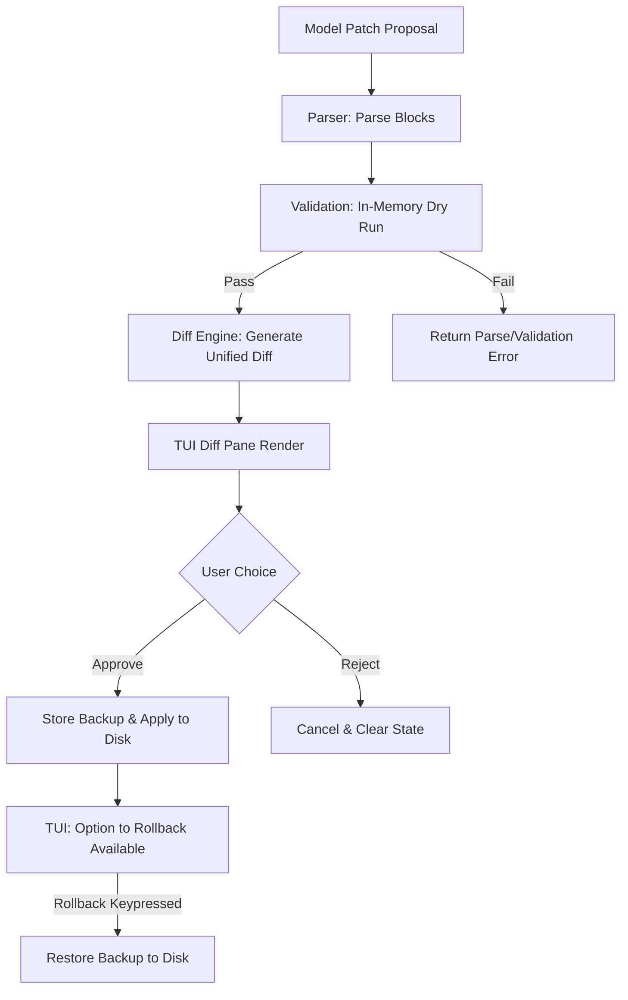

# Design Specification: Milestone G - Patch Workflow

## Status: Approved

---

## 1. Goal
Marshal needs a safe, robust, and interactive patch application workflow. Instead of editing files directly or rewriting them entirely, the LLM proposes targeted file modifications using search/replace blocks. These blocks are parsed, validated, diffed, and presented to the user for interactive approval/rejection. An in-memory rollback history ensures that any applied patch can be immediately reverted.

---

## 2. Requirements & Architecture



### 1. Parsing Search/Replace Blocks
The system parses search/replace chunks defined using Aider-style delimiters:
```text
File: relative/path/to/file.go
<<<<<<< SEARCH
old lines of code
=======
new lines of code
>>>>>>> REPLACE
```

The parsed representation is represented by:
```go
package patch

type FilePatch struct {
	Path   string
	Chunks []PatchChunk
}

type PatchChunk struct {
	Search  string
	Replace string
}
```

### 2. Validation & In-Memory Application
Before writing any changes to disk:
* The system counts occurrences of the `Search` block in the target file content using exact string matching.
* If a `Search` block occurs `0` times, validation fails (`"search block not found"`).
* If a `Search` block occurs `> 1` times, validation fails (`"ambiguous search block matches multiple locations"`).
* If a file contains multiple chunks, they are sequentially validated and applied *in-memory* to ensure intermediate compatibility.

### 3. Unified Diff Engine
We format the in-memory changes into a standard unified diff format (compatible with `git diff` readers) for rendering in the TUI:
* Up to 3 lines of context before and after the match are extracted.
* Lines to be removed are prefixed with `-`.
* Lines to be added are prefixed with `+`.
* Standard headers `--- a/...` and `+++ b/...` are generated.

### 4. Rollback Storage in Session State
`session.State` keeps track of backup copies of files before a patch is written to disk:
```go
type BackupFile struct {
	Path    string
	Content string
}
```
Methods on `State`:
* `StoreBackup(backups []BackupFile)`
* `RollbackBackup() error`
* `HasBackup() bool`

---

## 3. TUI Interactive Approvals & Legend
When a patch tool is executed:
* Standard input is disabled, and the security banner is rendered.
* The unified diff is displayed in the **Diff** panel of the TUI.
* Legend options:
  * `[Enter] Apply Patch`
  * `[d] Reject Patch`
  * `[r] Rollback Last Patch` (only visible when `HasBackup() == true`)
